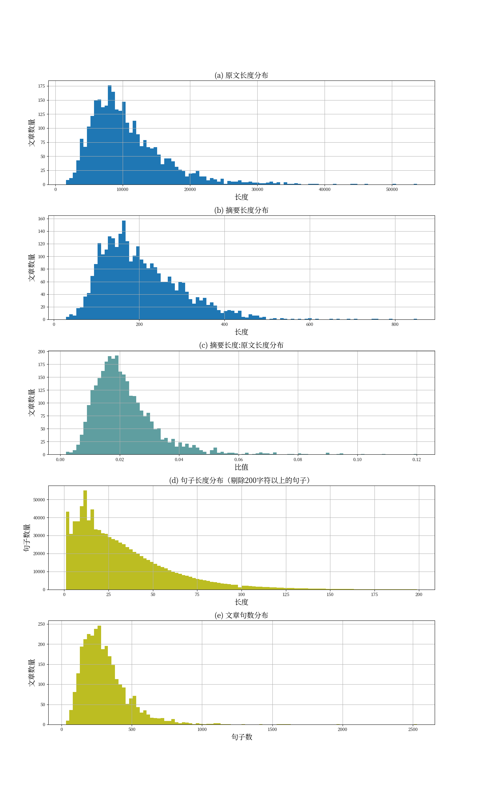

# CASSum

中文长文本数据集。原文和摘要主要是社会科学方面的学术论文。

爬取自中国社会科学院（CASS）的门户网站，故名为CASSum。

~~本数据集原先用于我毕业论文的撰写。~~

## 数据来源

中国社会科学院下属机构的部分网站设有“学术成果”或“科研成果”栏目，内含大量公开的社科领域论文全文及其摘要。CASSum中的论文和摘要来自法学所、历史研究所、哲学所、文学网、工业经济研究所五个部门。

## 数据处理方法

爬取到原始数据后：

1. 去重

2. 去除外文文段（去除英文摘要、法文摘要）

3. 去除空行和多余空白符

4. 去除“内容摘要”等字样

5. 去除摘要短于20字的数据

6. 去除原文短于200字的数据

7. 去除摘要长度和文本长度的比值小于0.15的数据

8. 去除原文不完整（如，原文含有“全文见xx刊物”）的数据

9. 人工检查摘要长度和文本长度比值不太正常的数据

## 数据集相关统计量

样本量较小，但是文本长度显著比LCSTS要长。LCSTS完全无法用于长文本摘要模型的训练。

| 数据集    | CASSum      | [LCSTS](https://arxiv.org/abs/1506.05865) |
| ------ | ----------- | ----------------------------------------- |
| 样本量    | 3061条       | 2108915条                                  |
| 原文平均长度 | 10746.70 字符 | 104 字符                                    |
| 摘要平均长度 | 205.27 字符   | 18 字符                                     |

### 相关分布



## 数据样例

`dataset.jl`文件为json line格式。

一行一条。每条数据格式如下：

```json
{
    "url": "原文链接",
    "text": "论文原文",
    "summary": "摘要"
}
```

样例如下：

```json
{
   "url": "http://iolaw.cssn.cn/zxzp/202212/t20221208_5569568.shtml",
   "text": "\n引言\n技术变革使得数据成为一类新的生产要素，在数据获取、利用、交易实践中产生了一系列纠纷，而产生法律界权保护之必要。然而，传统民法或知识产权法体系都难以对大数据集合进行恰当定位和保护。司法实践主要通过《反不正当竞争法》一般条款调整大数据纠纷，却存在法律适用标准模糊、不可预见、合理利用例外不明确等缺陷。我国正积极探索建立专门的大数据保护制度，在大数据保护制度路径选择中，理论上有不同观点：有学者主张采财产权保护模式，在数据客体之上设立新型“数据财产权”，为企业数据投资提供全面保护；[1]有学者则担忧设立新型“数据财产权”会阻碍数据共享和自由流动，主张采用行为法保护模式，通过完善反不正当竞争法对大数据提供保护。[2]数据保护立法完善需要在不同制度路径之间作出衡量和选择，是否设立新的数据财产权，很大程度上取决于财产权制度本身的可行性或可操作性。尽管多数观点倾向于在数据之上设立“数据财产权”，但现阶段大多数研究停留在概念厘清、正当性分析、制度框架勾勒的宏观层面，尚未就“数据财产权”的具体制度设计进行深入探讨而达成相对一致共识。[3]因此，立法难以等待数据保护路径问题被解决之后，再来探讨具体设计问题。欲明确数据保护立法路径，必先探索明确“数据财产权”的制度可能，与行为法保护模式之间就其优劣问题进行综合对比。\n事实上，就“数据财产权”构造，既有制度实践中存在直接的经验参照。在大数据出现之前，欧盟1996年《数据库保护指令》（以下简称《指令》）创设的数据库特别权利（Sui Generis Right）制度确立了为数据提供财产权保护的最早实践。大数据与数据库本质上都是数据集合，二者保护面临的问题具有相似性。构建“数据财产权”制度，相对务实的方式是在既有制度经验中寻求借鉴并进行渐进式改良。因此，为回应数据保护路径争议，本文拟按照提出假设——检验假设——改进假设的逻辑进行探讨，即假设未来立法者采取财产权保护模式，以最接近的既有制度经验——欧盟数据库特别权利制度为基础建构“数据财产权”的基本模型，进而检验财产权模式能否解决实践问题挑战，为数据保护路径选择以及保护范围厘定提供制度建议。\n一、“数据财产权”设权应然逻辑与现实路径\n构建大数据保护制度，前提是厘清大数据保护的正当性基础和待解决的基本问题。当前，主流观点之一主张在大数据集合之上设置新型财产权利，正当性基础主要是将数据类比于有体财产，基于劳动财产理论主张在数据之上设立新的财产权。如有学者认为：“数据企业通过大量收集个人信息以及非个人信息形成了新的数据集，而无数个人信息汇集成的数据集就成为了一个新的客体并在其上产生了数据企业的民事权利。这种法律效果与民事主体合法建造房屋而自该房屋建造完毕之时取得房屋的所有权是相同的。换言之，数据企业只要是合法地收集并存储数据，就可以基于这种行为取得对数据的权利。”[4]在权利构造上，数据财产权接近于物权设计，具有绝对性和排他性，是权利人直接支配特定的数据财产并排除他人干涉的权利，其权能包括数据财产权人对自己的数据财产享有的占有、使用、收益、处分的权利。\n将劳动财产理论以及传统物权模型直接适用于信息财产赋权存在明显局限性。因为在洛克式的劳动财产理论下，有体物必须拨归私有才能充分利用，故而存在私有财产赋权之必要，[5]并且有体物可以通过占有、添附等形式使财产脱离公有状态而向社会公示，某一民事主体对此有体财产的排他性占有、使用很少会对第三人或公共利益产生影响。然而，信息非竞争性、非排他性、非易耗性的公共物品特质决定了它在私有财产赋权必要性、权利取得要件以及排他性权能设置方面与传统有体物存在显著不同：第一，区别于有体物必须拨归私有才能最大化利用，非竞争性、非排他性的信息可以被无数人同时占有、利用，已生产而处于公有领域的信息不具有稀缺性而并无设置私有财产权的必要，不加限制地允许所有人共同占有、使用反而可以实现社会福利最大化；但是未生产信息具有稀缺性，需要私有产权保护以激励信息创造的人力和资本投入。故区别于有体财产以劳动作为财产赋权的正当性基础，信息产权赋权和权能设置应以激励未知信息创造为必要。第二，在信息生产过程中，民事主体虽然可以在公有领域信息的基础上，运用个人劳动进行进一步加工，但并非只要通过劳动即可取得对信息的排他性权利。因为智力成果创造并非是完全“无中生有”，作品创作以及技术发明都是既有知识之上的累积性创新，个人在公有领域之上的添附或创造，在何种程度上脱离公有领域成为“新的财产”面临着现实上的判断困难，必须从一定政策目标出发设定权利取得阈值并加以人为判断。第三，与传统有体财产不同，信息具有公共物品所具有的非竞争、非排他的特性，在其上设置排他性权利必将阻塞权利人之外的社会公众获取该信息的渠道，这对社会影响的范围远超过在有体物上创设物权的本旨，由于信息本身具有较强的公共属性，如果无法完成个人创造与公有领域的清晰界分，或者不加限制地授予他人在信息之上的排他权利，将会导致个人对于公有领域的不当垄断和侵占。\n有体财产与无体财产的特性不同，决定了数据在内的信息财产赋权难以直接套用劳动财产理论和传统物权模式，在知识产权等信息财产授权中，相对普遍接受的是功利主义方法，即财产制度的设计需要在信息创造与公众获取信息之间达成精确利益平衡，从而实现社会整体福利的最大化。从经济学的角度出发，已生产的公有领域的信息不具有稀缺性，故无论是否付出劳动都不需要赋予财产权，开放利用才能实现社会福利的最大化；未处于公有领域的信息是稀缺的，因为信息的生产过程具有特殊性，信息成果往往具有生产的高成本、复制的低成本、没有特定对手的占有特征，如果法律不加介入会导致信息利用的搭便车行为和外部性问题，进而造成信息生产的市场失灵，故而有必要构建信息成果的产权保护机制，恢复市场竞争过程进而实现资源的最优配置。因此，信息之上设置财产制度的正当性基础或总目标是要实现信息生产、利用效率的最大化，具体需要服务于三个子目标：第一，确保新的足够数量的信息能够被创造出来；第二，信息充分流动服务于生产；第三，将信息生产所需的社会成本降低至最低限度。[6]这一功能定位决定了数据在内的信息财产授权的基本规律：以信息共有为一般原则，信息财产赋权必要立足信息生产的市场实践并经历严格的市场失灵论证考验；为了实现激励创造之目标，其权利授予应以一定创新性为授权阈值；为保障公共利益和公有领域，其权利保护应以特定期限、限制、例外为约束。既有信息财产保护模式——著作权、专利权、商标权等均非依循单一哲学逻辑而建构成为一种绝对的财产权利，而是在近百年的制度演进之中，随着技术进步、商业模式变迁，不断自我调整其权能、期限、例外等制度设计以维持新的系统平衡，虽然导致了知识产权制度体系的“杂乱无章”，却是以实践理性在创造者与公共利益之间平衡的最优结果。\n从功利主义视角出发，当前大数据保护问题已基本满足信息财产赋权的一般前提或正当性基础：技术进步使得数据成为市场上生产、利用、流转的新一类“财货”，[7]由于数据具有一般信息的公共物品特性，在立法缺乏充分保护的前提下，存在数据生产、交易市场失灵的风险：一方面，大数据具有体量庞大、类型多样、快速变化、低价值密度的特点，导致大数据经济体现出一定的规模经济、范围经济的特点，即必须达到一定的数据量规模和范围才能获得实质性的竞争力，从而产生较高的沉没成本；另一方面，数据具有一般信息的非竞争、非排他和非易耗的特征，对数据进行复制的边际成本很低。如果法律上缺乏对于大数据集合的恰当定位和保护，竞争对手可以轻松获取和复制数据，导致两方面结果：第一，对必须公开才能利用的数据，将抑制企业在该领域的投资积极性甚至出现市场失灵；第二，对企业可以借助隐匿技术加以利用的数据，企业可能为了避免数据落入公有领域，将对数据严密保护并避免交易而抑制数据的流动和再利用。因此，有必要以法律之力保障企业投资数据之“产权”，[8]从而恢复市场的资源配置功能。然而，市场失灵并不当然地证成构建“数据财产权”，还必须存在新型财产权模式建构的可行性。换言之，是否建立数据财产权制度，关键在于该制度是否具有可操作性，即能否在数据收集者与社会公众之间划定明晰边界，实现保护数据投资与公众获取数据之间的恰当利益平衡。\n因此，在“数据财产权”制度建构探索中，不在于精致完美的理性设计，而在于作出平衡各方利益的现实构造，相对务实的方式是立足最接近立法经验进行制度构建。虽然大数据是新世纪之后的产物，但数据这一客体形式却早已出现并被纳入既有知识产权制度调整框架。20世纪80年代，信息技术发展使得人类第一次大规模地以电子数据存储和处理信息，推动了数据库产业的产生和繁荣，回顾历史，数据库保护的立法挑战与当今大数据问题具有高度相似性：计算机技术使得大量的信息能够以数字格式创建或转化为数字格式存储，提升了信息的存储能力并降低存储成本，与数据存储技术进步相伴而生的是数据获取和使用能力的提升，通过计算机程序可以快速地查找、分析数据，互联网的出现也实现了在线使用数据库，从而提升了数据库的访问便利和市场化能力。在信息时代，数据库作为信息生产和创造的原材料具有了独特的市场价值，技术进步扩大了数据库影响和作用的同时也使得复制数据库迅速而便利，对开发者市场化利用数据库和投资回收形成了实质威胁。[9]为了激励投资以繁荣数据库产业，欧盟（时为“欧洲经济共同体”，简称“欧共体”）制定了《指令》，最早在全球范围内确立了对非创造性数据库内容的财产权保护，即数据库制造者在收集、订正和展示数据方面付出了实质性投资的，数据库内容将受特别权利保护。进入数字经济时代，面对大数据保护需求，特别权利也成为了保护大数据的主要制度选项之一，欧盟委员会关于《指令》评估的第二次专家报告指出，“特别权利可能比预想地要更广泛地适用于大数据”，[10]德国学者Matthias Leistner认为，特别权利在数字经济下具有无可否认的适用潜力，绝大多数情况下大数据都可以为特别权利所涵盖。[11]可以说，欧盟数据库特别权利保护制度是与大数据最为关系密切的知识产权制度模式，其制度运行为我国数据保护实践提供了最为直接的经验参照。\n二、“数据财产权”理论构造\n数据库财产权模型可为建立“数据财产权”提供直接的经验参照。然而，由数据库到大数据在技术层面和商业应用层面都发生了实质性变化，基于特别权利制度探索构建“数据财产权”制度，需要将特别权利制度置于大数据商业实践之下，检验其适用可行性并作出相应改进。具体而言，在大数据生成、利用、流转的商业实践中，涉及数据生成主体、收集主体、获取主体和再利用主体四方面，大数据保护法律秩序构建则要实现不同方面的利益平衡：1.促进数据投资和创新；2.建立良好运作的竞争性市场和维护公共利益；3.保护消费者利益、用户个人信息。2021年《个人信息保护法》的颁布可以确保用户个人在与在数据收集者、处理者的互动中人格利益不受不法侵害，但仍有两方面任务需要数据财产保护制度完成，即促进数据投资创新和保障市场竞争。构建一项新的“数据财产权”，需要回答保护客体、保护条件、保护权能、保护期限、限制例外等一系列问题，结合制度目标，主要有三方面任务：第一，基于财产权设置的正当性基础，恰当地界定客体要件；第二，确定财产权保护权能，以充分实现创新激励的制度目标；第三，基于促进市场竞争、保障公共利益的利益平衡考量，对财产权权能作出必要限制。\n（一）“数据财产权”客体要件\n客体要件是财产权制度构建的基础，在数据库财产权保护中，特别权利制度从两方面界定客体要件：第一，界定保护客体，即数据集合构成“数据库”；第二，界定保护条件，要求权利人在数据库制作中付出了实质性投资。符合此两项条件，方能赋予数据制作者排除他人提取、再利用数据库实质性部分或全部的权利。现结合“数据库”和“实质性投资”两个要件，就“数据财产权”的客体要件探讨如下：\n1.保护客体。欧盟《指令》将调整对象界定为“数据库”，第1条规定，数据库包括以下要件，独立作品、数据或素材的集合，经过系统或有序编排，并可以通过电子或其他方法独立访问。数据库必须是独立作品、数据或者其他材料的集合。根据欧盟法院解释，[12]由于数据库保护的制度逻辑与传统知识产权不同，为避免数据库保护客体扩大到版权保护客体的范畴而对既有知识产权制度产生冲击，故而作出此要求将数据库与版权法上的作品相区分，如一部电影虽然由不同材料集合组成，总体来看它属于一个整体故不属于数据库所调整的范畴，除此之外，如果构成数据库的素材之间可以相互分离而不影响其价值则可满足该要件。此外，从数据库的技术特点出发，其要求独立素材的集合要经过系统、有序的编排并可进行单独访问，但该要件门槛设置相对较低，也并不要求独立素材在物理上以系统、有序的方式进行存储，而只要可以通过技术手段例如电子、电磁或者其他手段（例如索引、目录或者特定分类方法）对独立材料进行检索即可。[13]\n构建“数据财产权”应明确调整的基本对象，即如何在法律意义上界定所要调整的“大数据”。从技术层面来看，由“数据库”到“大数据”发生了实质性的变化，大数据与数据库的都以“数据”为基础元素，即在计算机及信息网络流通以0和1二进制符号组合表现出来的比特形式，二者根本上都是“数据”的集合。不同之处在于，传统数据库依据事先预定好的关系模型收集、存储相关数据，从而实现对于有价值数据的管理、分析，但对大体量、低价值密度、需要实时分析应用的数据则无法事先分类处理存入数据库中再来分析。[14]传统数据库面临的挑战正是大数据技术发展的起点，在新一代技术架构下，人类可以通过高速收集、检索和分析数据，进而在短时间内大体量、多样性的数据之中获取有价值信息，其来源不仅包括已经结构化处理的数据库，更主要的是数字环境下用户浏览痕迹、设备信息、分享资料等半结构化、非结构化数据，其客体范围经历了实质性扩张，传统数据库主要包含经过智力创造或加工的数据信息，大数据集合则突破此限制将大量事实性数据作为其直接来源。如果从法律层面界定需要保护的大数据，首先，与数据库相同，“数据财产权”保护的客体应当是独立数据、作品或素材的集合，从避免与传统知识产权保护客体相重叠的角度，有必要继续保留此要件。其次，“数据库”要求数据经过系统或有序编排，并可以通过电子或其他方法独立访问，虽然目前的大数据集合基本都可以通过数据分析软件实现对数据的独立检索而符合该要件，但该特征已并非大数据集合的必备或者典型特征，恰恰大部分都是半结构化、非结构化数据，故而不必遵循该要件。因此，应当相对宽泛地将保护客体定位为数据集合，即一切独立电子数据、作品或素材的集合，从而将多数实践情形纳入调整范围。\n2.保护条件。传统知识产权制度从鼓励创造出发，仅对具有独创性的作品或者具有新颖性、创造性的技术方案提供排他保护，数据内容往往具有事实性而无法纳入传统知识产权制度保护的范畴。然而，除了新的知识创造，事实性信息收集和累积也具有一定社会价值，构成社会生产生活的必要条件，故需要法律保护此类投资以鼓励这种事实性信息的生产。因此，数据库特别权利制度一改知识产权制度保护创造的传统，而将保护投资作为制度目的，数据库制造者在收集、订正、展示其数据内容方面付出了实质性投资的，才可获得特别权利保护。\n从避免市场失灵出发，虽然保护数据投资具有充分的正当性，但并非所有数据的投资都值得保护，因为非独创性数据具有较强的公共属性，如果广泛地依据他人投资而在数据之上设置一种垄断性的权利，可能会置自由竞争和信息获取自由于危险之地。因此，需要严格界定投资所需达到的条件，主要包括受投资保护的类型和投资所需达到的程度两方面。\n（1）受保护投资的类型。在数据库特别权利保护中，根据《指令》第7条第1款规定，制造者在收集、订正、展示其数据内容方面付出了实质性投资的，才获得特别权利保护。与此相区别的是，数据创造的投资不受特别权利保护。主要原因在于，数据内容的创造者掌握了数据的单一来源，对数据创造投资的保护将导致创造者对于该单一来源数据的垄断。2004年欧盟法院在BHB等四起案件中对此作了专门解释，[15]欧盟法院认为，《指令》第7条第1款规定的收集内容的投资必须理解为在制造数据库的过程中获取、搜集独立材料的投资，验证内容的投资指的是在数据创造或运行过程中为了保证数据库信息内容准确性、可靠性进行的投资。该案中，当事人组织比赛生成马匹列表等投资属于创造数据的投资，创造数据并不属于收集和验证数据的投资。数据“创造”与“收集”的区分主要是为了平衡投资保护与信息传播之间的关系，避免通过数据库保护对“单一来源数据”的垄断。[16]然而，该区分却在很大程度上限制了特别权利保护的适用范围，因为特别权利保护制度旨在保护数据库制作的投资，事实上数据库内容制作的投资要远超过数据库制作本身的投资，[17]故有学者认为，BHB等四个判决在事实上“肢解”了《指令》所规定的特别权利，使特别权利的存在失去了意义。[18]\n相对于传统数据库，大数据集合中存在大量的用户行为、设备生成的原始数据及基于此产生的衍生数据，与传统数据库数据收集、订正、展示投资不同，大数据集合往往并不涉及数据的订正和展示，主要是制造智能设备、建设用户网络从而收集数据以及进一步加工数据的投资，如果按照数据创造与数据收集的区分，大部分数据投资将无法获得保护。[19]具体而言，依生成方式不同，大数据可分为贡献数据（Volunteered Data），指的是用户个人自行在网络上分享的网络资料，如姓名、生日、照片等；观测数据（Observed Data），从用户或机器的活动中自动获得的行为数据，如用户访问网站内容记录、设备运行状况等；衍生数据（Inferred Data），指的是以用户贡献数据或观测数据为基础通过复杂运算而获得的衍生数据，如基于个人购买产品的倾向、信用评级等通过聚类算法或预测得出分类数据。[20]贡献数据主要是用户自行创造生成，平台向用户收集并在平台上展示，其应当是数据收集的投资并不存在太大争议。[21]观测数据主要通过各种传感器和智能设备生成，严格来讲应属于BHB案意义上数据创造的范畴，如2018年欧盟委员会《指令》评估报告指出：“在目前的情况下，《指令》似乎不适用于设备生成数据，这些数据库的生成与其数据的创造密切相关，而判例法将对于内容创建的投资排除出了特别权利的保护。”[22]对原始数据加工形成衍生数据的投资也应属于数据创造投资的范畴。由此来看，实践中真正需要保护的数据投资主要是数据创造的投资，如果在“数据财产权”制度中继续坚持严格的数据收集和创造的区分，可能导致面临类似于数据库特别权利制度被“肢解”的困境。因此，可考虑改变该区分原则，适应大数据发展的现实，保护企业在数据生成、收集、加工中付出的实质性投资。[23]\n（2）受保护投资的条件。从保护和鼓励投资的制度目标出发，投资应达到一定程度才受法律保护。特别权利保护要求数据库制造者必须付出了“实质性投资”，欧盟立法并未对此作出明确的最低要求，实践中一般采取“最小排除规则”（de minimis exclusion rule），只要投资并非是微不足道的，则给予特别权利保护，这可以从定量的角度加以认定，即可量化的人力物力资源投入达到一定的量；或者从定性的角度加以认定，即付出的人力物力投入产生了较高品质。欧盟各国法院对此采取了较低标准，如德国联邦最高法院在案例中认可4000欧元的投资即属于“实质性投资”，在意大利，罗马法院裁定，当事人在数据库中插入4000条记录，然后对收集到的数据进行调整、修订，需要付出一定金钱和时间成本，即属于“实质性投资”。[24]然而，在大数据保护中，“实质性投资”标准过低可能导致公有领域被侵占的风险，在将数据创造投资纳入保护范围后更是如此，例如，整个集合数据条目较少，某一企业在创建单个要素或数据条目付出了较多投资，按照“最小排除规则”就有可能被纳入保护，若如此将导致一些不应受保护的事实性信息数据绕过版权法的限制而获得财产权保护，进一步限制公共领域的行动自由。因此，本文赞同“实质性投资”应坚持相对高标准，它虽然直接无法量化，但从调整市场竞争的角度，只有企业收集具有实质数量的数据条目进而产生实际价值或者竞争优势时，才具有保护的必要性。[25]如日本《不正当竞争防止法》规定，只有相当数量积累而具有价值的数据才受到保护，可综合考虑累积产生数据的附加值、利用的可能性、交易价格以及投入收集和分析付出的劳动力、时间、成本等进行判断。[26]数据财产权保护投资标准的界定也应采取此标准。\n（二）“数据财产权”保护权能\n“数据财产权”建构的核心之一是要界定权利的排他范围从而解决大数据投资的“搭便车”和市场失灵问题，特别权利制度提供了针对数据利用形式设立排他权的现实参照，不过从数据库到大数据的技术变革不仅仅改变了客体形式，同时改变了数据利用的商业模式，特别权利保护模式是否仍然有效有待检验。立足大数据保护的现实问题，可首先分析特别权利权能的适应性及问题，进而以此为基础探索“数据财产权”的权能建构。\n具体而言，在大数据时代，数据收集、分析技术进步几乎引发了所有产业部门的数字化转型：互联网经济下，网络平台可以通过提供数字内容吸引用户注意，同时收集用户数据，借助大数据分析实现供需精准匹配，并通过海量数据提升平台算法质量；传统工业也经历着由传统制造向物联网、智能制造的转型，企业可以通过传感器收集用户行为、设备、环境数据并进行实时分析，以节能或者提升产量的方式提升工厂或者商店运营效率，或者将分析结果用于开发新产品或者现有产品的改进。因而数据已成为企业在数字经济中的竞争力来源。在数据收集、利用以及处分的商业链条中，网络平台或者智能设备制造商可以投资生成或者收集原始数据，直接进行数据分析利用或对外转让；对竞争者、数据分析企业等数据获取相关主体，除了与数据收集者协商进行数据共享或购买数据产品外，由于数据利用过程的公开性以及数据的非竞争性、非排他性特点，不可避免地出现他人未经数据收集者允许获取、利用数据的情形，而导致实践中数据收集者与相关利益主体之间的系列纠纷。根据数据获取、利用的模式不同，大数据实践纠纷可分为典型类型：第一，未经授权获取网上公开数据。绝大多数内容平台上的用户贡献数据，其价值实现以完全公开或限制公开为前提，竞争者可通过网页爬虫爬取网页数据。[27]第二，在开放平台的情形下，他人未经授权或超出授权爬取数据。除贡献数据必须对外公开才能利用外，企业可将观测数据等存储于服务器上施加技术措施保护而保持对数据事实上的控制，其可以选择对数据进行独占性利用，也可通过交易共享实现数据价值最大化。实践中，国内大多数大型互联网平台向第三方应用开放应用程序接口（API），通过差别化公开、限定公开的方式向不特定主体进行数据共享，同时也出现他人未经授权、超出授权获取数据的情形。[28]第三，对数据衍生产品进行传播和转售的行为。除直接对数据进行利用或转售获利，企业还可以对数据进行分析生成衍生数据、开发数据产品，由于数据可以非竞争、非排他可以无限复制的特点，他人可能通过产品复制、账号分租等形式对数据产品进行转售而不当获利。[29]\n事实上，特别权利制度在构建之初即需要面对不断发展的数据收集和分析技术，故在权能构造上，相对于著作权等传统知识产权，其排他行为的类型化程度相对模糊，从保护投资的目标出发为数据库提供了一种相对宽泛的保护，而存在对当前大数据实践纠纷规制之潜能。[30]具体而言，特别权利包括排除他人对数据库内容的“提取”和“再利用”两项权能，除了对单个数据或者非实质性部分不予保护外，特别权利保护涵盖了所有未经允许复制以及向公众传播数据库内容而损害投资者投资的情形，根据欧盟法院的解释，《指令》的立法目的是保护收集、验证、提供数据过程中进行的实质性风险投资，保护其投资结果不受任何未经授权的占用，从该目的出发，“提取”应理解为指任何未经授权的占用数据库全部或部分内容的行为，其是否直接从权利人处获得、以电子或手抄方式获得、是否与原数据库存在竞争等在所不问。[31]关于数据“再利用”，指的是通过发行、出租、在线传输或其他传输方式，将数据库的全部或部分内容向公众传播。任何以权利人同意之外的方式向公众提供数据库内容的行为都应被禁止，并不要求一次性向公众传播数据库的全部/实质部分内容，只要不特定主体可以持续访问数据库的全部/实质部分，因其实质剥夺了权利人回收投资成本的机会即构成侵权。[32]\n特别权利制度之下的“提取”和“再利用”权能涵盖了直接或间接盗用数据库实质性部分而对数据投资产生损害的情形。[33]“数据财产权”与数据库特别权利共同的目的均在于保护数据投资，因而理论上可以将特别权利的权能移植到“数据财产权”之下。在大数据利用的商业模式下，无论是开发数据产品或大数据分析，基本都涉及到提取和再利用，未经允许对大数据集合的获取和利用行为也将落在“提取”和“再利用”的范围之内。[34]就前述实践中三类典型纠纷情形而言：第一，针对未经授权爬取网上公开数据的情形，如在大众点评诉百度案中，[35]百度通过网络爬虫爬取大众点评服务器上大量数据而存储到自身服务器中进行分析利用，必然会涉及对数据库实质部分的“提取”，同时进一步将该数据在自身网站上展示，则将侵犯数据库制作者的“再利用”权利，此外，若第三人进一步从百度公司处获取相关数据进行分析利用，将同样构成对大众点评“提取”和“再利用”排他权利的侵犯；第二，针对开放平台中未经授权、超出授权爬取数据的情形，如在腾讯诉抖音、多闪案中，[36]抖音公司超出腾讯公司授权抓取用户信息并在其应用中进行提供，虽然每次抓取限于用户个人信息，但该公司以重复和系统的方式进行抓取，将构成对数据库实质部分的“提取”和“再利用”；第三，针对传播数据衍生品的行为，如在淘宝诉美景案中，[37]美景公司组织用户分享账户、出租账户查看淘宝产品数据，虽然并未涉及对数据库内容复制或“提取”，但在数据库制造者预期之外向新公众提供了数据库的访问，而侵犯了数据库制作者的向公众传播权或“再利用”的权利。\n在新的技术条件下，数据库特别权利的“提取”和“再利用”权能体现出了较强的制度张力，现有大数据实践纠纷均可为特别权利的“提取”和“再利用”权能所涵盖，可以实现纠正市场失灵而保护投资和促进创新的功能。因此，“数据财产权”可参照数据库特别权利确定“提取”和“再利用”两项权能，禁止他人未经允许复制、向公众传播数据集合的全部或实质性内容。\n（三）“数据财产权”限制与例外\n数据财产法律制度构建不仅要为数据投资提供充分保障，同时要兼顾竞争保障和公共利益平衡。因为数据具有较强的公共性，信息垄断风险是数据保护立法面临的“先天不足”，也是最难点。数据库权利保护制度在建立之初即因此饱受争议，因为在版权法中长期存在的基本原则是对于事实信息和原始数据不予保护，而特别权利突破了这一原则，依据企业在数据收集、订正和展示过程中的投资，为事实性数据提供了一种排他权的保护，存在着阻碍信息自由流动和垄断风险，尤其对于独家来源数据的情形，特别权利保护将会完全排除二级市场的竞争。[38]因此，欧盟法院在BHB等案中通过数据创造与数据收集的区分限缩了特别权利的适用范围；在欧盟委员会2005年对《指令》的第一次评估中，由于《指令》在促进欧盟数据库产业发展方面的效果并不理想，曾考虑过废除整个《指令》、取消特别权利制度或者修改特别权利制度，最终基于产业阻力和政策考量选择了维持现状。[39]建立“数据财产权”，最直接的问题仍然是对数字市场竞争和数据自由流动的潜在限制。有学者担忧，因为大数据价值实现的最大化在于数据共享和再利用，以特别权利的模式对于大数据集合过于宽泛的保护，会排除相关利益主体的合理使用，并限制数据流动和再利用。[40]\n在欧盟《指令》立法之初，由于数据的公共属性，欧共体委员会在草案中确立了特别权利十年的保护期限，并规定了较为严格的特别权利例外和强制许可制度。[41]草案提交到欧共体理事会后，欧盟理事会从鼓励建立强大的数据库产业这一目标，采取了“高标准、严保护”的立法思路，[42]如经济与社会委员会在提交给欧共体理事会的意见中提出：“某种客体是否应该被保护？通过规定短期限的知识产权保护并附加强制许可来对这个问题进行妥协是错误的。更可采取的办法是，判断它是否符合保护的条件，如果符合，就赋予其高标准的知识产权保护。”[43]因此，《指令》将保护期限延长为15年，删除了强制许可限制，并仅规定了两项例外：1.第8条规定，对于数据库的非实质性部分，数据库制作者不得阻止合法用户的提取和再利用，但是这种使用不得与数据库的正常利用相冲突，也不得损害数据库制造者的合法利益。由于特别权利保护的范围仅限于数据库的实质部分，该条规定用户可提取或再利用数据库的非实质部分，并不具有实质的限制或例外意义，被认为在事实上是多余的；[44]2.第9条规定了特别权利保护的例外情形，允许成员国可规定不经授权直接对数据库实质内容提取和使用的情形：在为私人目的提取非电子数据库内容；在标明来源的前提下，基于教学或者科学研究的非商业目的在合理范围内提取；以及为了公共安全、行政司法程序而提取或者再利用数据库内容。\n首先，关于权利例外，虽然《指令》第9条规定了数据库保护的例外，但对比版权法上的保护例外，特别权利的保护例外情形要狭窄得多，且版权法上的限制和例外情形无法在数据库特殊保护中适用。[45]实践中，相关例外情形在促进数据合理利用中作用十分有限，如私人使用仅限于纸质数据库，在《指令》制定之时电子数据库还并未普及，该条具有一定适用意义，但在信息时代其已经成为具文，除此之外，教学科研例外以及因行使公共职权的例外在实践之中也较少地被援引。[46]作为促进数据流通利用的完善方案，有学者主张应当在版权保护和数据库特别权利之间建立动态联系，将《信息社会版权指令》第5条规定的限制例外情形适用于特别权利，并将数据与文本挖掘等新版权立法中规定的限制情形在适当条件下自动适用于特别权利。[47]然而，作者权体系下著作权的限制例外情形相对封闭，其中很大部分并不适用于当前大数据的分析利用场景，而且新的数据分析应用模式在不断产生。在“数据财产权”构建中，若为平衡公共利益保留充分的空间，则不建议引用作者权体系下著作权的限制例外情形，可考虑引入美国版权法上合理使用（fair use）的判断框架，在为数据投资提供宽泛保护的前提下，对不断出现的涉及公共利益的数据提取和再利用行为根据以下要素综合判断“合理”：（1）使用的目的与性质；（2）数据集合的性质；（3）所使用部分的质、量及在整个数据集合中的占比；（4）对数据集合的潜在市场或价值产生的影响。如果构成合理使用则不构成侵权。\n其次，关于权利限制，通过后的欧盟《指令》并未对数据库特别权利设置有效的限制。但在该制度的历史建构过程中，由于数据的公共属性，在1992年立法之初，欧共体委员会已经考虑到了对于特别权利保护单一来源数据可能对二级市场造成的潜在影响，从而在数据库保护指令制定的提案中规定了强制许可制度，该提案规定了“向公众提供的数据库中所包含的作品或材料无法独立地创建、搜集或者从其他来源获得”的情形以及公共机构编制的公开数据库应当以“公平和无歧视”的条款对外进行强制许可，并规定了成员国内部的仲裁机制，兼顾与个人数据、隐私、数据安全和保密之间的利益平衡。[48]在欧共体理事会采取“高标准、严保护”的立法思路后，该制度最终被删除。欧盟法院在2004年BHB案中通过数据创造与收集的区分大幅度限缩了特别权利的保护范围，旨在避免单一来源数据垄断问题。在“数据财产权”制度构建中，如前所述，从避免市场失灵的制度目的出发，不仅仅应保护数据投资也应当保护数据生成的投资，不可能避免地将会导致数据收集者对单一来源数据垄断，从而限制或排除二级市场竞争。对此，可引入1992年《指令》草案中的方案来限制权利化解垄断问题，即对单一来源数据集合，权利人有义务通过公平、合理、无歧视的条件进行对外许可。[49]\n最后，权利保护期限问题。知识产权保护目标在于促进创新，它以公共领域与私人领域之间进行交换并相互增益而实现公有知识领域的扩张和进步，因此私有知识产权保护必然要遵循一定期限限制，保护期限届满后即必须回公共领域，唯有如此，该知识领域才会不断丰富。然而，如何界定数据的保护期限却面临着现实困难。在数据库特别权利保护中，《指令》第10条规定，数据库的保护期限为15年，如果因实质性新的投资导致数据库内容发生实质性改变，其保护期限将重新起算。对大数据集合而言，与一般数据库的开发和利用时期相比，其具有较强的时效性，15年的保护时间过长；同时，在数字经济环境下，动态数据库越来越多地取代静态和离线数据库，由于其不断进行更新，因此将面临着权利人对数据库永久享有保护的问题。[50]适应数据分析利用的时效周期，可将“数据财产权”保护期限定为相对较短的5年，[51]从而在鼓励投资与公有知识领域增长之间建立平衡；同时，对于持续性更新的数据库，法律应当明确仅对更新的实质部分进行有限的保护，对于旧的数据库内容应当为公众免费提供。\n（四）小结\n综上所述，在假设采取财产权保护模式的前提下，可借鉴欧盟数据库特别权利的实践，确定“数据财产权”的基本制度框架，即相关主体在数据生成、收集、加工中付出实质性投资，使得数据产生相当数量累积而产生实质性价值时，则投资者对由独立数据、作品或素材组成的数据集合享有“数据财产权”，其中包括禁止他人提取和再利用数据集合实质或全部内容的排他性权利，“数据财产权”的保护期限可定为5年。同时，如果他人的数据提取或再利用行为属于“合理使用”，将不构成侵权，对于单一来源数据，权利人有以公平合理无歧视条件对外许可的义务。\n三、“数据财产权”制度反思及建议\n当前，大数据保护采财产权保护或行为法保护模式尚处于争论之中，唯有明确“数据财产权”的理想制度设计，方能在不同路径之间作出衡量和选择。数据库特别权利制度是对非独创性数据提供财产权保护的最早立法实践，可资借鉴。\n（一）保护路径：暂不设立数据财产权而延续反不正当竞争法保护\n关于大数据产权保护路径的争论，主要围绕财产权为主导的权利规制路径与反不正当竞争法规制主导的行为规制路径模式展开。欲作出路径选择，必先厘清两种保护路径之间的区别关系并对比其优劣势。\n这种区分讨论数据产权保护制度并不具有直接建构意义，因为在传统财产权观念下，财产权的构建模式是由客体界定权利，将财产权理解为对客体即物的绝对性支配，从而可直接套用物权模式而建构占有、使用、收益、处分权能。现代财产观念中，已普遍接受霍菲尔德财产权本质是对人性而非对物性的理论，即财产权并非是对某物的绝对性支配，而是调整人与人之间的不特定性权利，财产权在现实主义的概念化和去结构化之后，不再受其客体的束缚而成为一种对世性权利的“权利束”，将这一系列权利组合到一起形成“财产权”的意义在于以符合社会观念的方式进行“模块化”处理可以降低社会交易成本。[52]因此，数据产权保护的核心不在于权利法与行为法的形式区分，而在于如何能恰当地厘定和发现权利人对世地排他性使用与公众合理利用的边界。\n在发现这一边界的过程中，反不正当竞争法保护与权利保护之间具有一定功能区分和渐进式演进关系。二者之间都遵循着功利主义目标，即保护企业投资成果而防止竞争失灵，但依据市场失灵的确定性和对第三人造成不利影响的可能性，法律依次提供不同强度的保护：依据一般条款考量各种因素进行利益平衡、排除特定行为、提供模块化权利保护、提供绝对的排他权保护。[53]在此过程中，反不正当竞争法保护承担着新型权利“孵化器”的作用，可以在一般原则框架之下灵活地对特定投资成果之上不正当竞争行为进行规制，经过司法实践不断类型化发展成熟，进而通过模块化的方式组合成为固定的权利束，转化成为一类新的知识产权或新型财产权。[54]\n权利保护所具有的封闭性和确定性特点决定了在一项法益产生初期不应当急于将其确立为一项知识产权或财产权，因为尽管在保护需求出现之初，权利化保护可能为特定产业或者利益相关者所强烈呼吁，但一旦对于特定客体或授予知识产权保护扩大保护范围，即难以退回到之前的保护状态。欧盟数据库保护即存在此问题，在数据库出现之后，欧盟为了促进数据库产业繁荣，急于为数据库确立一种财产权利，事后发现数据库特别权利在促进欧盟数据库产业发展方面的效果并不理想，欧盟虽然曾考虑过废除整个《指令》、取消特别权利制度或者修改特别权利制度，最终基于产业阻力和政策考量选择了维持现状。\n因此，是否建构“数据财产权”或继续采用反不正当竞争法保护，关键看现实条件能否满足权利保护所需的确定性要求。参照欧盟数据库特别权利制度，从保护投资避免市场失灵出发，“数据财产权”禁止他人对大数据集合全部或实质部分未经允许的提取和再利用，可以满足保护数据投资和激励创新的功能，面临的突出问题或风险仍然在于，过于广泛的排他性权利会限制数据自由流动并造成数据垄断，如何在数字经济发展初期准确地识别各种合理使用利益而设置排他权的限制和例外，成为了适用财产权制度保护大数据的真正挑战。将“数据财产权”与反不正当竞争法保护相对比，“数据财产权”保护的最大优势在于企业投资保护的确定性，但在当前数据利用和交易实践中，绝大多数数据处于企业事实控制之下，企业可以通过技术手段对数据提供第一层面的事实保护，即使针对部分公开数据以及突破技术措施不当获取数据的情形，反不正当竞争法之下通过一般条款规制“搭便车”行为即可以实现对企业投资的有效保护，通过财产权保护的优势并不明显。与欧盟数据库保护问题类似的是，大数据保护面临的核心问题不在于如何为企业数据投资提供充分保护，而是如何在一般性地保护企业数据投资的前提之下识别各种合理利用需求设置保护例外，保障数据自由流动和再利用。当前大数据技术正处于发展初期，数据分析利用实践正处于不断发展演进之中，各种相关利益主体诉求难以被准确表达和平衡，因此无法全面和精确地提炼出有利于促进公共利益的限制和例外情形。虽然我们可以设置开放式条款为保障公众的合理使用需求留有余地，然而，一旦在数据之上排他性地设置一种财产权，无疑将数据利用收益的所有可能都分配给了权利人所独占，其他社会公众如果想利用合理使用条款，需要承担更强的论证义务，并面临更高的法律风险和不确定性，有可能从一开始就扼杀这种合理使用产生的可能，难以实现数据分析利用价值的最大化，并对自由竞争产生阻碍。\n因此，结合欧盟数据库保护的经验来看，我国不必急于在数据之上确立一类新的财产权利。当前正处于数字经济发展早期，为避免财产权保护模式封闭和僵化的缺陷，我们应继续在反不正当竞争法的框架下保护数据财产利益，充分发挥反不正当竞争法新型权利“孵化器”作用，将不断发生的各种实践纠纷置于反不正当竞争法的灵活框架下进行具体衡量，在防止“搭便车”的一般保护原则之下识别各种正当利益，通过大量司法案例积累，以类型化的方式提炼出各类不正当竞争行为和正当利用行为，在实践检验基础之上，将各类不当行为通过模块化的方式组合成为固定权利束，最终确立一类新的财产权利。\n（二）基于财产权探讨对完善反不正当竞争法保护的启示\n虽然我国并不必急于设立新的“数据财产权”，但却并非意味着“数据财产权”的讨论毫无意义。如前所述，财产权保护与行为法保护模式之间的区别并非截然对立，只是保护确定性上有所不同。欧盟数据库特别权利源于反不正当竞争法上的盗用原则（Doctrine of Misappropriation），前述“数据财产权”模型也根植于此，其与反不正当竞争法保护都致力于保护企业投资的共同制度目的，二者只是一般假设和保护确定性有所不同。因此，即使不采取财产权保护模式，而通过细化反不正当竞争法的一般条款进行保护，前述“数据财产权”保护客体、规制行为、限制例外的探讨仍然具有意义，财产权保护模式下的相关要件，可以为反不正当竞争法的行为规制路径所借鉴和吸收。[55]基于此，现就反不正当竞争法下的大数据保护制度完善分析如下。\n在我国司法实践中，现有民法、知识产权法以及反不正当竞争法规定的不正当竞争行为类型都难以对数据盗用行为提供直接规制，法院主要适用反不正当竞争法一般条款进行调整。一般认为，不正当竞争行为成立应满足存在竞争关系、行为违反诚信原则或公认的商业道德、损害竞争者的合法权益三个要件，在大数据保护司法实践中，各级法院往往对于竞争关系作出宽泛认定，将裁判焦点聚焦于后者，其裁判思路可归纳为：1.确认数据收集者在数据收集过程中付出了实质性投资，大数据集合能为其带来经济利益和竞争优势，因此数据收集者对其数据集合具有竞争法上的利益；2.竞争者未经数据收集者授权获取数据的行为，损害了数据收集者的财产利益；3.该行为违反公认的商业道德而具有不正当性。由于一般条款具有高度的概括性和模糊性，反不正当竞争法保护在实践中面临着司法裁判标准不统一、不可预见以及竞争利益权利化的问题：第一，关于竞争者合法权益，企业虽然对其投资收集数据具有合法利益，在何种范围内可以排除他人的获取和利用，不同法院认定存在分歧。如在大众点评诉百度案中，法院认为，百度公司用垂直搜索获取大众点评数据本身不具有违法性，但是其使用数据应当遵循“最少、必要”的原则，但百度公司大量抓取并实质替代了大众点评的服务而构成不正当竞争；[56]在腾讯诉抖音、多闪案中，抖音依用户授权逐条抓取微信平台的用户个人数据，法院同样认定可构成不正当竞争。[57]在一般条款之下，企业采取何种行为、在何种范围或程度抓取他人数据构成不正当竞争行为尚待明确。第二，关于行为不正当性判断存在不同标准。例如，在大众点评诉百度案中，法院认定，百度公司垂直搜索获取大众点评数据本身不具有当然违法性，但当其构成实质性替代即存在市场失灵的风险时才认定构成不正当；在“酷米客”诉“车来了”案中，法院概括地认定企业对其投资收集数据具有合法权益，第三人未经允许的数据爬取行为系“不劳而获”“食人而肥”的行为，具有不正当性。[58]对此，有学者认为，现行司法实践试图激活反不正当竞争法一般条款中的“合法权益”而确立事实上的“数据财产权”，[59]但这却是一种仅保护投资者利益而对利益相关主体缺乏充分考量的“财产权”模式，就其保护限制、例外却缺乏精确的利益考量。\n针对当前反不正当竞争法一般条款适用过于概括和模糊的问题，我国虽并无必要设立专门财产权制度，但却可借鉴“数据财产权”讨论的成果将一般条款的适用具体化，提升大数据集合法律保护的确定性：\n1.数据集合保护条件及禁止行为。如果企业在数据生成、收集、加工中付出实质性投资，使得数据产生相当数量累积而产生实质性价值，为了保护投资和激励创新，应当根据禁止盗用原则提供保护，禁止盗用他人数据投资的行为，包括禁止未经允许对大数据集合的不正当获取和利用。关于获取和利用可借鉴数据库特别权利保护中“提取”和“再利用”的界定，获取即将数据集合的全部或实质性部分永久或暂时转移到另一载体上，再利用即以数据收集者预期之外的方式将数据集合内容向他人提供。从企业投资保护的角度出发，该保护既不应当排除一切数据抓取行为，也不应当仅限于对他人营业构成实质性替代的情形，而是排除他人对大数据集合全部或实质部分的抓取和利用，对非实质性部分的抓取和利用则不受法律保护。关于抓取内容实质性与否的判断，可参照欧盟数据库特殊权利保护的实践，[60]即并不取决于被获取部分在整体数据集合中的比例，而是应从保护投资的目标出发，考察被抓取部分是否具有独立分析和利用的价值。\n2.正当获取和利用数据的行为。为了避免利益保护过度而限制竞争，在根据禁止盗用原则为企业投资提供一般性保护的前提下，应当保护他人对数据的正当利用。在判断竞争者数据获取和利用行为正当与否时，可考虑引入版权法体系下开放性合理使用判断标准。实践中，如在阿里巴巴诉码注公司案中，[61]杭州滨江法院已考量相关因素判断数据抓取行为正当与否：（1）使用行为的目的和特点，包括数据使用的用途，是否有利于市场效率和社会利益；（2）被使用客体的性质，包括数据的公共属性；（3）被使用部分的数量和质量，包括数据的抓取和使用是否超过合理限度；（4）使用对被使用客体潜在市场或价值的影响，包括数据抓取和适用行为是否对经营者利益产生实质影响。该裁判标准可供实践参照，即如果相关行为符合合理使用标准，则不作为不正当获取、利用数据的侵权行为。\n3.数据集合保护的限制。在欧盟数据库立法中，由于保护单一来源数据会排除二级市场竞争而受到高度关注，故在BHB案中欧盟法院将数据创造投资排除出保护范畴，而伴随着该标准适用的松动，对单一来源数据的强制许可再次被提上议程。目前，我国适用反不正当竞争法一般条款保护数据投资同样面临着同样问题，如在前述“酷米客”诉“车来了”案中，公交车数据具有较强的公共属性，原告“酷米客”公司作为与深圳公交公司合作的唯一数据控制主体，如果将相关行为认定为不正当竞争，完全排除他人对数据的获取无疑会造成二级市场即公交车信息服务的垄断而消除竞争，司法实践对此却缺乏足够关注。在数据保护实践中应对单一来源数据作特别考量，由于企业在收集数据中同样付出了实质性投资，完全将之排除在保护之外，将不利于该类数据的收集和利用。因此，在反不正当竞争法保护中，可采用欧共体委员会在1992年《指令》提案中的强制许可方案，对于未经许可爬取、利用单一来源数据的行为，人民法院可以认定相关行为构成不正当竞争，但不判定停止侵权，要求竞争者以公平、合理、无歧视条件向数据收集者支付合理费用。\n注释：\n[1]相关观点主要可参见：龙卫球：《数据新型财产权构建及其体系研究》，载《政法论坛》2017年第4期；程啸：《论大数据时代的个人数据权利》，载《中国社会科学》2018年第3期；申卫星：《论数据用益权》，载《中国社会科学》2020年第11期。\n[2]相关观点主要可参见：杨翱宇：《美国法信息盗用制度的演进及其对我国数据财产权益保护的启示》，载《政治与法律》2019年第11期；丁晓东：《论企业数据权益的法律保护——基于数据法律性质的分析》，载《法律科学（西北政法大学学报）》2020年第2期。\n[3]参见崔国斌：《公开数据集合法律保护的客体要件》，载《知识产权》2022年第4期。\n[4]同注释[1]，程啸文。\n[5]［英］约翰·洛克：《政府论（下）》，丰俊功、张玉梅译，北京大学出版社2014年版，第34页。\n[6]See Stanley M. Besen, Leo J. Raskind, An Introduction to the Law and Economics of Intellectual Property,5 Journal of Economic Perspectives 3(1991).\n[7]参见［奥］卡尔·门格尔：《国民经济学原理》，刘挈放译，上海人民出版社2001年版，第5页。\n[8]本文运用“产权”概念指的是经济意义上的产权，有别于法律意义上的“财产权”，一般指个人对商品（或资产）拥有的经济产权，即通过交易个人直接地或间接地期望消费商品（或资产的价值）的能力，与剩余价值的索取紧密相关的权利。参见［以］约拉姆·巴泽尔：《产权的经济分析》（第二版），格致、三联书店、上海人民出版社2017年版，第3-4页。\n[9]参见［澳］马克·戴维森：《数据库的法律保护》，朱理译，北京大学出版社2007年版，第2-3页。\n[10]Directorate-General for Communications Networks, Content and Technology (European Commission), et al, Study in Support of the Evaluation of Directive 96/9/EC on the Legal Protection of Databases (May 2018), https://op.europa.eu/en/publication-detail/-/publication/5e9c7a51-597c-11e8-ab41-01aa75ed71a1.\n[11]See Matthias Leistner, Big Data and the EU Database Directive 96/9/EC: Current Law and Potential for Reform, in S. Lohsse, R. Schulze & D. Staudenmayer eds., Trading Data in the Digital Economy: Legal Concepts and Tools, Nomos Press,2017, pp.27-58.\n[12]See Case C-444/02, Fixtures Marketing v. OPAP, ECLI:EU:C:2004:697.\n[13]P. Bernt Hugenholtz, Something Completely Different: Europe’s Sui Generis Database Right, in S. Frankel & D. Gervais eds., The Internet and the Emerging Importance of New Forms of Intellectual Property, Wolters Kluwer Press,2016, p.211.\n[14]参见李战怀等：《从数据库视角解读大数据的研究进展与趋势》，载《计算机工程与科学》2013年第10期。\n[15]Case C-203/02 The British Horseracing Board Ltd and Others v. William Hill Organization Ltd, ECLI:EU:C:2004:695.\n[16]同注释[10]。\n[17]European Commission, Evaluation of Directive 96/9/EC on the legal protection of databases, SWD(2018)147 final.\n[18]See William Cornish, David Llewelyn & Tanya Aplin, Intellectual Property: Patents, Copyrights, Trademarks & Allied Rights, Sweet & Maxwell Press,2007, pp.834-836.\n[19]See Josef Drexl, Designing Competitive Markets for Industrial Data —Between Propertisation and Access,8 Journal of Intellectual Property, Information Technology and Electronic Commerce Law 257(2017).\n[20]Jacques Crémer, Yves-Alexandre de Montjoye & Heike Schweitzer, Competition Policy for the Digital Era (May.2019), http://ec.europa.eu/competition/publications/reports/kd0419345enn.pdf.\n[21]E.g.see Case C-202/12, Innoweb BV v. Wegener ICT Media BV and Wegener Mediaventions BV, ECLI:EU:C:2013:850.\n[22]同注释[10]。\n[23]事实上，为了回应实践需求，德国法实践上也在逐渐淡化数据“创造”与“收集”的区分。Vgl. BGH MMR 2011,188.\n[24]同注释[10]。\n[25]同注释[3]，崔国斌文。\n[26]刘影、眭纪刚：《日本大数据立法增设“限定提供数据”条款及其对我国的启示》，载《知识产权》2019年第4期。\n[27]参见上海知识产权法院（2016）沪73民终242号民事判决书。\n[28]参见天津市滨海新区人民法院（2019）津0116民初2091号民事裁定书。\n[29]参见杭州市中级人民法院（2018）浙01民终7312号民事判决书。\n[30]参见李谦：《法律如何处理数据财产——从数据库到大数据》，载《法律和社会科学》2016年第15卷。\n[31]Case C-203/02 The British Horseracing Board Ltd and Others v. William Hill Organization Ltd, ECLI:EU:C:2004:695;Case C-304/07 Directmedia Publishing (2008) ECR I-7565= ECLI:EU:C:2013:850.\n[32]See Case C-202/12 Innoweb ECLI:EU:C:2013:850.\n[33]［德］马蒂亚斯·莱斯特纳：《数据库的保护》，载［英］埃斯特尔·德克雷主编：《欧盟版权法之未来》，徐红菊译，知识产权出版社2016年版，第346页。\n[34]Kirsten J. Schmidt & Herbert Zech, Anwendungen die Tatbestandsvoraussetzungen der §§87a ff. UrhG erfüllen k?nnen, CR 7(2017), S.417.\n[35]参见上海知识产权法院（2016）沪73民终242号民事判决书。\n[36]参见天津市滨海新区人民法院（2019）津0116民初2091号民事裁定书。\n[37]参见杭州市中级人民法院（2018）浙01民终7312号民事判决书。\n[38]同注释[33]。\n[39]See Commission of The European Communities, First Evaluation of Directive 96/9/EC on The Legal Protection of Databases(Dec.2005), https://ec.europa.eu/info/sites/default/files/evaluation_report_legal_protection_databases_december_2005_en.pdf.\n[40]同注释[19]。\n[41]See Commission of The European Communities, Proposal for a Council Directive on the Legal Protection of Databases, COM/92/24 Final.\n[42]［澳］马克·戴维森：《数据库的法律保护》，朱理译，北京大学出版社2007年版，第64页。\n[43]Economic and Social Committee, Opinion on the Proposal for a Council Directive on the Legal Protection of Databases, para 2.6.2,1993 O.J.(C 19).\n[44]同注释[17]。\n[45]See Annette Kur, et al, First Evaluation of Directive 96/9/EC on the Legal Protection of Databases—Comments by the Max Planck Institute for Intellectual Property, Competition and Tax Law, Munich,37 International Review of Intellectual Property and Competition Law 551(2006).\n[46]同注释[17]。\n[47]同注释[11]。\n[48]同注释[43]。\n[49]同注释[11]。\n[50]同注释[17]。\n[51]同注释[10]。\n[52]See Wesley N. Hohfeld, Fundamental Legal Conceptions as Applied in Judicial Reasoning,26 The Yale Law Journal 710(1917).\n[53]See Reto M. Hilty, The Law Against Unfair Competition and Its Interfaces, in R. M. Hilty & F. Henning-Bodewig eds., Law Against Unfair Competition: Towards a New Paradigm in Europe?, Springer Press,2007, pp.1-52.\n[54]See Annete Kur, What to Protect, and How? Unfair Competition, Intellectual Property, or Protection Sui Generis, in N. Lee, G. Westkamp, A. Kur & A. Only eds., Intellectual Property, Unfair Competition and Publicity: Convergences and Development, Edward Elgar,2014, pp.11-32.\n[55]同注释[3]崔国斌文，第24页。\n[56]参见上海知识产权法院（2016）沪73民终242号民事判决书。\n[57]参见天津市滨海新区人民法院（2019）津0116民初2091号民事裁定书。\n[58]参见深圳市中级人民法院（2017）粤03民初822号民事判决书。\n[59]参见龙卫球：《再论企业数据保护的财产权化路径》，载《东方法学》2018年第3期。\n[60]See Case C-545/07 Apis-Hristovich EOOD v. Lakorda AD, ECLI:EU:C:2009:132.\n[61]参见杭州市滨江区人民法院（2019）浙0108民初5049号民事判决书。\n作者：张浩然，中国社会科学院法学研究所助理研究员。\n来源：《法学杂志》2022年第6期。\n", 
   "summary": "围绕数据财产利益保护路径，理论界存在财产权和行为法保护不同观点；财产权具体制度设计不明晰，导致保护路径探讨难以深入。数据库特别权利制度是对数据提供财产权保护的最早实践，参照此制度可确定“数据财产权”理想模型，即在数据生成、收集、加工中付出实质性投资，数据产生相当数量累积而具有实质性价值的，投资者有禁止他人对数据集合全部或实质性部分提取和再利用的权利。将“数据财产权”与反不正当竞争法保护对比，财产权保护优势在于可为数据投资提供全面保护，风险在于宽泛排他性权利会限制数据自由流动并造成垄断。在保护路径上，我国应适应数字经济发展的早期特点暂不设立“数据财产权”，继续通过反不正当竞争法保护数据财产利益。在保护制度完善中，可吸收财产权制度设计相关内容提升反不正当竞争法保护的确定性，禁止竞争者对他人付出实质性投资的数据集合不正当获取和利用，参考版权法的合理使用要素判断行为正当与否，对单一来源数据实施公平、合理、无歧视许可，构建起保护投资与数据共享的利益平衡框架。"
}
```


